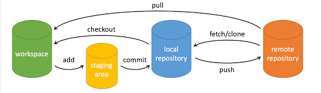

基本工作流程

	1. 克隆远程仓库（首次操作）
	git clone <仓库URL>
	cd <仓库目录>
	2. 创建并切换分支（推荐每个任务使用独立分支）
	git checkout -b feature/your-feature-name
	3. 进行代码修改
	在本地分支编辑文件
	4. 查看修改状态
git status
	5. 添加修改到暂存区
	git add <文件名>  # 添加特定文件
	git add .        # 添加所有修改
	6. 提交修改到本地仓库
git commit -m "描述性的提交信息"
	7. 拉取远程最新代码（避免冲突）
git pull origin main  # 或你的主分支名
	git pull origin LTE_develop
	
	8. 推送代码到远程仓库
git push origin feature/your-feature-name
	git push origin ypc-1
	后续修改，在本地分支
	git add 文件名
	git commit -m "描述"
	git pull origin LTE_develop 
	git push origin ypc-1
	
	9. 远端操作合并
新建合并请求，会自动检测到pycharm中GIT推的分支

git reset HEAD^            # 回退所有内容到上一个版本 
git log     查看最近提交记录，找到要回退的节点

直接删除新增
File -> localhistory -> revert

回退commit前的状态
git reset --soft HEAD~1

删除分支

# 强制删除本地分支
$ git branch -D [branch-name]
# 删除指定的本地分支
$ git branch -d [branch-name]

查询配置
git config
git config -l

*************强制使本地代码与远程仓库一致的方法****************
要将本地代码强制与远程仓库完全一致（丢弃所有本地更改），可以按照以下步骤操作：
方法一：完全重置本地仓库
1. 首先获取远程最新更改（但不合并）：
git fetch origin
2. 重置本地分支到远程分支：
git reset --hard origin/<branch-name>
         例如，如果是main分支：
       git reset --hard origin/main
3. 清理未被跟踪的文件（可选）：
git clean -fd
方法二：删除本地分支并重新检出
4. 确保你在其他分支（不是要重置的分支）：
git checkout other-branch
5. 删除本地分支：
git branch -D <branch-name>
6. 重新检出远程分支：
git checkout -b <branch-name>origin/<branch-name>
或者
git fetch origin
git checkout main             # 切换到main分支
git reset --hard origin/main  # 重置到远程main分支
使用pull命令强制覆盖
git fetch origin
git reset --hard origin/main
git pull origin main
例如：
git fetch origin
git reset --hard origin/LTE_develop
git pull origin LTE_develop

如果只想放弃本地修改但保留未跟踪文件
git fetch origin
git reset --hard origin/main
git clean -fd
例如：已经提交一个远端分支ypc-1后有修改，又想丢弃修改
git fetch origin
git reset --hard origin/ypc-1
git clean -fd
git clean -fd会删除所有未跟踪的文件和目录，使用前请确认是否需要这些文件。
在执行这些操作前，建议先使用git status查看当前状态，确保不会丢失重要数据。

注意事项
• 这些操作会永久丢弃所有本地更改，包括未提交的更改和未推送的提交
• 如果本地有重要更改，请先备份
• 执行前最好确认远程分支名称是否正确
• git clean -fd 会删除所有未被跟踪的文件和目录，请谨慎使用
完整示例（假设分支为main）
git fetch origin   获取远程最新更改（但不合并）
git checkout main   main为远端项目主干名称
	e.g. git checkout origin/LTE_develop
git reset --hard origin/main
	e.g. git reset --hard origin/LTE_develop
git clean -fd
执行后，你的本地main分支将与origin/main完全一致。

来自 <https://chat.deepseek.com/a/chat/s/2ea75975-7392-4b6e-b689-6c9ab4ea29a9> 

*************************************************************

解决推送代码后，别人修改导致冲突
git merge 是 Git 中用于合并分支的命令，它可以将一个分支的更改整合到另一个分支。

gitmerge <branch-name>
将指定的 <branch-name> 合并到当前所在的分支。
合并其他分支到当前分支
好像可以用在更新工程后

高级操作
合并提交（简化提交历史）
git rebase -i HEAD~3  # 合并最近3次提交
解决冲突
	1. 当 git pull 或 git merge 出现冲突时
	2. 编辑冲突文件（Git会标记冲突位置）
	3. 解决冲突后：
git add<冲突文件>
git commit
撤销操作
	• 撤销未暂存的修改：
git checkout -- <文件名>
	• 撤销已暂存未提交的修改：
git reset HEAD <文件名>
	• 修改最后一次提交：
git commit --amend
代码审查流程（GitHub/GitLab）
	1. 推送分支后，在平台上创建 Pull Request/Merge Request
	2. 等待团队成员审查
	3. 根据反馈进行修改并推送更新
	4. 审查通过后合并到主分支
最佳实践
	1. 提交信息要清晰明确
	2. 每个提交只做一件事
	3. 频繁提交，少量多次
	4. 推送前先拉取最新代码
	5. 使用 .gitignore 排除不需要版本控制的文件
需要更详细的某个部分说明吗？
